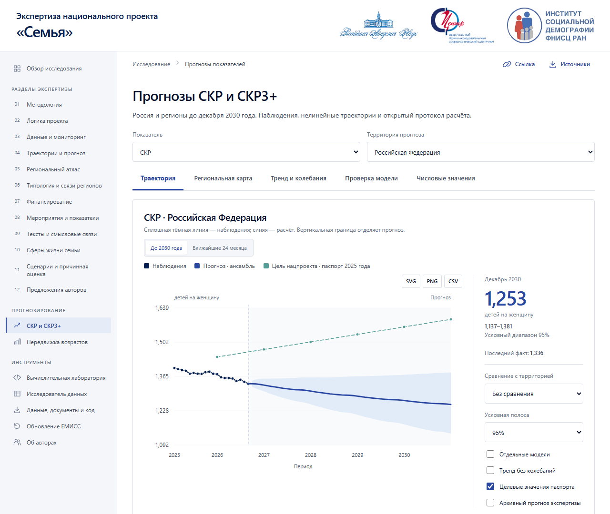
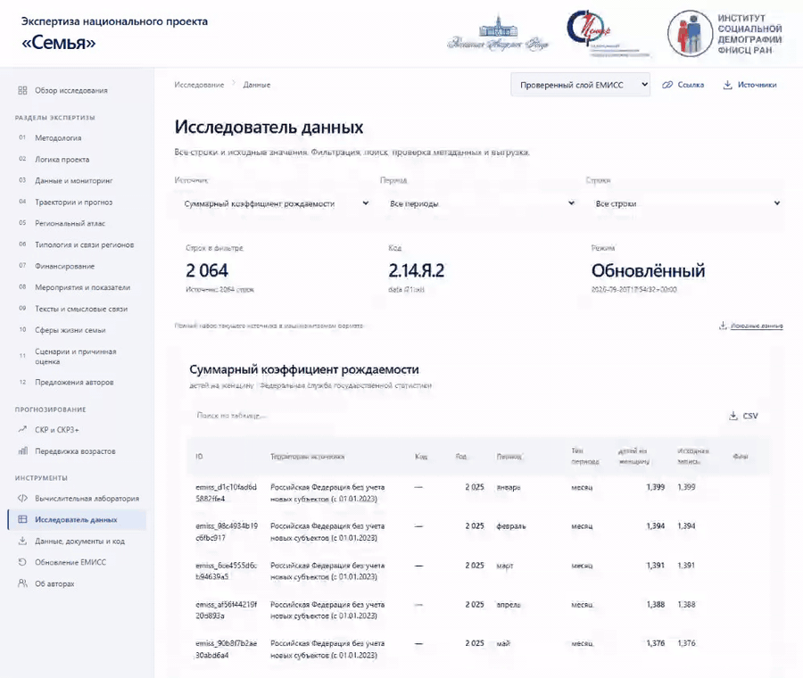
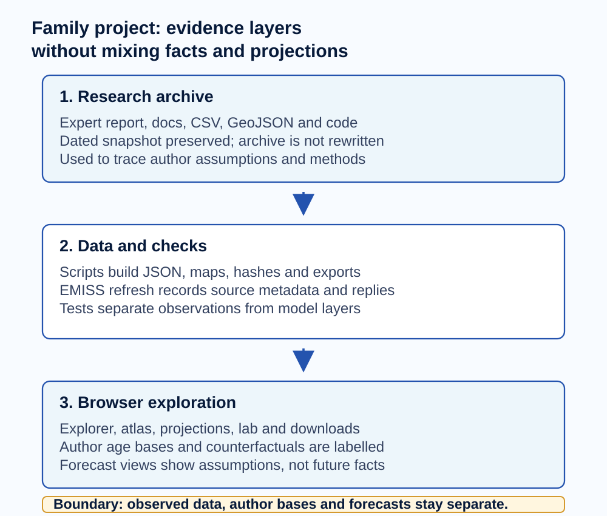
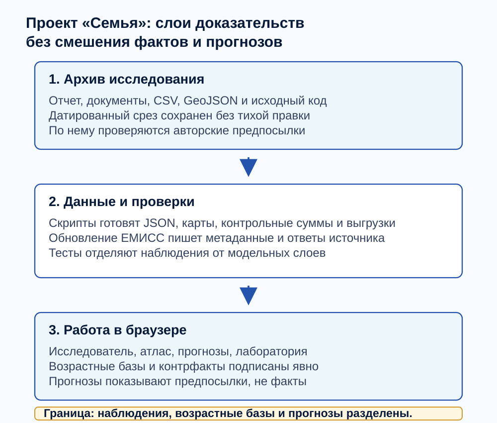

# Family Research Platform

[English](#english) | [Русский](#русский)

Live site: <https://arseniy24rus.github.io/family/>

## English



*The application interface is currently Russian-only; the README is bilingual.*



*Demo: data explorer, projection chart, regional map, and population module in one review path.*



*Workflow diagram: source archive, checked data layers, browser pages, and published static assets.*

### Purpose

This repository turns the research expertise for the Russian national project "Family" into a static, inspectable browser platform. Its audience is not a casual dashboard viewer only: it is built for researchers, project owners, reviewers, and editors who need to trace a number back to a source, distinguish observed statistics from authored assumptions, and export the exact slice they are discussing. The repository is public; `"private": true` in [package.json](package.json) only prevents accidental npm publication. The public Pages build is a static site with no server application.

### Workflow

The core scenario is a review session. A user opens the data explorer, checks the current EMISS layer for a fertility or demographic indicator, moves to the TFR / TFR3+ projection workspace, switches between the national trajectory, a regional map, and a trend decomposition, then opens the age-shift population module for a selected territory. The important point is separation: observed EMISS values, the authors' archived age bases, counterfactual teaching examples, and platform projection modules are labelled as different layers. Forecast charts are displays of model assumptions and uncertainty, not facts about the future.

### Data and methodology

The source archive is documented in [PROVENANCE.md](documentation/PROVENANCE.md). The main research document is "Expertise of the national project Family", dated 2026-05-14, authored by T. K. Rostovskaya, A. M. Sitkovsky, A. B. Sinelnikov, and V. N. Arkhangelsky. The repository also contains project documents, extracted tables, GeoJSON, original code, downloads, and a separately checked EMISS refresh layer. [METHODS.md](documentation/METHODS.md) explains the statistical and visual conventions; [PROJECTIONS.md](documentation/PROJECTIONS.md) explains the newer monthly-log ensemble and cohort-age modules, including their short-history validation limits.

### Architecture

The application architecture is intentionally plain. [src/app.js](src/app.js) owns routing, shell state, and page loading. [src/core/data.js](src/core/data.js) loads and validates browser data. [src/pages/projections.js](src/pages/projections.js), [src/pages/population.js](src/pages/population.js), atlas, text, research, and tools pages compose the user-facing surfaces. Charts, maps, networks, and tables are SVG/DOM components under [src/components/](src/components/). [scripts/build.mjs](scripts/build.mjs) copies the static build to `docs/`; Python scripts refresh EMISS, prepare projections, and rebuild demographic inputs. Expensive browser calculations use workers in `src/core/worker.js` and `src/core/cohort-client.js`. The published site reads static JSON, CSV, SVG, and downloadable files from `docs/`.

### Limits

Limitations are part of the product. The platform is not an official EMISS, Rosstat, or government site. Updating EMISS does not rewrite the 2026-05-14 expertise. The monthly projections use current historical versions, not vintage publication archives, and short 1- and 3-month checks do not validate December 2030 outcomes. The cohort module depends on explicitly labelled external age bases and forecast assumptions. Causal effects, policy success, and budget sufficiency are not inferred from charts.

### Local usage

Run locally with Node 22+ and Python. For a quick preview of the generated static site:

```bash
python -m pip install -r scripts/requirements-analytics.txt
npm run build
npm run serve
```

<details>
<summary>Full local validation commands</summary>

```bash
npm test
npm run build
npm run validate
npm run test:python
npm run test:browser
npm run serve
```

</details>

`npm run serve` starts `python -m http.server 8080 --directory docs`. For data refresh work, see `npm run forecast`, `npm run demography`, and the EMISS scripts, but do not treat regenerated files as a new scientific edition unless their provenance and assumptions are reviewed. The current README visuals were captured from the live static app with Playwright; no mock screens were drawn.

### Licensing and attribution

Licensing and attribution are deliberately conservative. [NOTICE.md](NOTICE.md) states that research materials, statistical files, maps, logos, author images, and original scripts keep their own origin and conditions. The repository does not place third-party materials into the public domain. Before re-publication outside the owner-controlled GitHub Pages context, confirm rights for included documents and images and cite the research authors, source, version, and calculation layer.

<details>
<summary>Deployment notes retained from the previous README</summary>

Build the site with `npm run build`; publish the generated `docs/` directory through GitHub Pages. Relative paths and hash routes are used, so the repository name does not need to be hard-coded. The `.github` workflows refresh EMISS and deploy on the default branch; GitHub schedule timing is best-effort and can be disabled on inactive public repositories. After any scheduled run, inspect GitHub Actions logs and the `docs/data/latest/` manifests before citing a refreshed value.

</details>

## Русский


*Интерфейс приложения сейчас русскоязычный; README двуязычный.*


*Демонстрация: исследователь данных, прогнозный график, карта регионов и демографический модуль в одном маршруте проверки.*



*Схема: исходный архив, проверенные слои данных, страницы браузера и опубликованные статические файлы.*

### Назначение

Этот репозиторий превращает экспертизу национального проекта «Семья» в статическую исследовательскую платформу. Она нужна не только для красивого просмотра графиков: основной адресат - исследователь, владелец проекта, редактор или рецензент, которому важно дойти от числа до источника, увидеть методическую оговорку и выгрузить ровно тот срез, который обсуждается. Репозиторий публичный; `"private": true` в [package.json](package.json) только предотвращает случайную публикацию в npm. Опубликованный GitHub Pages сайт работает как набор статических файлов без серверного приложения.

### Сценарий

Типичный сценарий начинается с «Исследователя данных»: пользователь выбирает показатель и слой «проверенный ЕМИСС», смотрит период и источник, затем переходит в рабочую область СКР / СКР3+, сравнивает траекторию, карту регионов и разложение тренда, после чего открывает «Передвижку возрастов» для выбранной территории. Главное правило платформы - не смешивать слои. Наблюдения ЕМИСС, возрастные базы авторского источника, учебные контрфакты и прогнозные модули подписаны отдельно. Прогнозы показывают предпосылки, модельный диапазон и ограничения, а не уже наступившие факты.

### Данные и методика

Происхождение материалов описано в [PROVENANCE.md](documentation/PROVENANCE.md). Основной источник - экспертиза национального проекта «Семья» от 14.05.2026, авторы Т. К. Ростовская, А. М. Ситковский, А. Б. Синельников и В. Н. Архангельский. В репозитории также есть документы проекта, извлечённые таблицы, GeoJSON, исходные скрипты, скачиваемые архивы и отдельный проверяемый слой обновления ЕМИСС. [METHODS.md](documentation/METHODS.md) фиксирует статистические и визуальные соглашения, а [PROJECTIONS.md](documentation/PROJECTIONS.md) описывает новые модули monthly-log ensemble и возрастной передвижки, включая ограничения короткой проверки.

### Архитектура

Технически приложение устроено просто. [src/app.js](src/app.js) управляет маршрутом, оболочкой и состоянием. [src/core/data.js](src/core/data.js) загружает и проверяет данные браузера. Страницы прогнозов, демографии, атласа, текстов, исследования и инструментов находятся в [src/pages/](src/pages/). SVG-графики, карты, сети и таблицы собраны в [src/components/](src/components/). [scripts/build.mjs](scripts/build.mjs) копирует готовый статический сайт в `docs/`; Python-скрипты обновляют ЕМИСС, готовят прогнозы и демографические входы. Затратные расчёты вынесены в веб-воркеры `src/core/worker.js` и `src/core/cohort-client.js`. Опубликованный сайт читает JSON, CSV, SVG и документы из `docs/`.

### Ограничения

Ограничения не спрятаны в сносках. Это не официальный сайт ЕМИСС, Росстата или Правительства РФ. Обновление ЕМИСС не переписывает экспертизу 14.05.2026. Прогнозы используют текущие исторические значения, а не архив прошлых публикаций; проверки на 1 и 3 месяца не подтверждают точность до декабря 2030 года. Когортный модуль зависит от явно подписанных внешних возрастных баз и прогнозных предпосылок. Причинные эффекты, успешность политики и достаточность бюджета из графиков автоматически не следуют.

### Локальный запуск

Локальный запуск требует Node 22+ и Python. Быстрый просмотр собранного статического сайта:

```bash
python -m pip install -r scripts/requirements-analytics.txt
npm run build
npm run serve
```

<details>
<summary>Команды локальных проверок</summary>

```bash
npm test
npm run build
npm run validate
npm run test:python
npm run test:browser
npm run serve
```

</details>

`npm run serve` запускает `python -m http.server 8080 --directory docs`. Для обновления расчётных слоёв есть `npm run forecast`, `npm run demography` и EMISS-скрипты, но новые файлы нельзя цитировать как новую научную редакцию без проверки происхождения и предпосылок. Визуалы для README сняты Playwright с реального статического приложения, не собраны как макеты.

### Права и атрибуция

Условия использования описаны осторожно: [NOTICE.md](NOTICE.md) сохраняет происхождение исследовательских материалов, статистических файлов, карты, логотипов, фотографий и исходных скриптов. Этот репозиторий не объявляет сторонние материалы общественным достоянием. Перед внешней публикацией нужно подтвердить права на документы и изображения и ссылаться на авторов экспертизы, источник, версию и конкретный расчётный слой.

<details>
<summary>Сохранённые заметки о публикации</summary>

Соберите сайт командой `npm run build` и публикуйте каталог `docs/` через GitHub Pages. Пути относительные, маршруты используют `#`, поэтому имя репозитория не зашито в код. Рабочие процессы в `.github` обновляют ЕМИСС и публикуют основную ветку; расписание GitHub выполняется не строго по минутам и может отключаться у неактивных публичных репозиториев. После планового запуска проверяйте журналы GitHub Actions и манифесты `docs/data/latest/`, прежде чем цитировать обновлённое значение.

</details>
